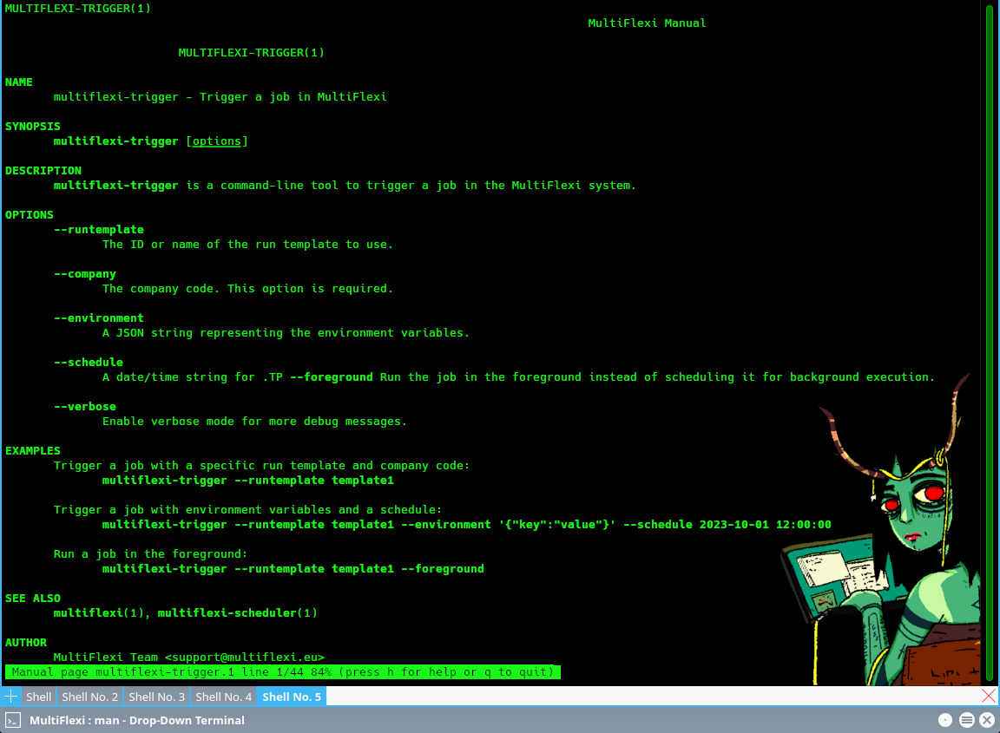

Command Line Utilities
======================

MultiFlexi provides several command line utilities to manage and interact with the system. Below is a list of available utilities and their descriptions:

.. toctree::
    :maxdepth: 2
    :caption: CLI Topics

1. **multiflexi-app2json**
    - Converts application configuration to JSON format.

2. **multiflexi-cli**
    - Command line interface for interacting with MultiFlexi. Includes system status command (``multiflexi-cli status``), telemetry testing (``multiflexi-cli telemetry:test``), and comprehensive entity management. For more details, see :doc:`reference/cli` and :doc:`credential-type`.

3. **multiflexi-executor** / **multiflexi-run-template**
    - Executes scheduled jobs and tasks. As a daemon it polls the schedule queue and launches due jobs. With ``-j <JOB_ID>`` it runs an existing job inline.
    - With ``-r <RUNTEMPLATE_ID>`` (also available as ``multiflexi-run-template``) it queues a new job for the given RunTemplate to run *now*, waits for the daemon to finish it, then reproduces the job's stdout, stderr and exit code. The daemon must be running for the queued job to be picked up.
    - Usage:

      .. code-block:: bash

         # Schedule a RunTemplate to run now and wait for the result
         multiflexi-run-template -r <RUNTEMPLATE_ID> [-o <output_file>] [-t <seconds>]

    - ``-t, --timeout`` sets the maximum seconds to wait for the daemon to run the job (``0`` waits forever; default ``300``, or the ``RUNTEMPLATE_WAIT_TIMEOUT`` environment variable). On timeout the command exits ``124``.
    - ``-E KEY=VALUE`` injects a one-time environment override into the job's environment. Repeat the flag to inject multiple values. The override is applied on top of the RunTemplate's configured environment (overrides win). Values are never logged.
    - ``--env-json='{"KEY":"VALUE"}'`` accepts a JSON object whose keys and values are treated as env overrides, equivalent to repeating ``-E`` for each pair. If both ``-E`` and ``--env-json`` are given, ``-E`` entries take precedence. Invalid JSON causes a non-zero exit.

      .. code-block:: bash

         # Run RunTemplate 1 with a one-time environment override
         multiflexi-executor -r 1 -E IMPORT_SCOPE=2025-11-01

         # Pass multiple overrides
         multiflexi-executor -r 1 -E FOO=bar -E BAZ=qux

         # Pass overrides as a JSON object
         multiflexi-executor -r 1 '--env-json={"IMPORT_SCOPE":"2025-11-01"}'

      These flags are used by the job-chaining system to inject producer output into
      consumer jobs. See :doc:`concepts/job-chaining` for details.

4. **multiflexi-job2env**
    - Export job configuration as environment variables file.

5. **multiflexi-job2script**
    - Export job configuration as a script.

6. **multiflexi-json-app-remover**
    - Removes applications based on JSON configuration.

7. **multiflexi-json2app**
    - Converts JSON configuration to application configuration.

8. **multiflexi-json2apps**
    - Converts multiple JSON configurations to application configurations.

9. **multiflexi-phinx**
    - Perform database migrations using Phinx.

10. **multiflexi-probe**
    - Probes the system for status and health checks.

11. **multiflexi-cli status**
    - Displays MultiFlexi system status including database configuration, system services, entity counts, Zabbix monitoring, and OpenTelemetry telemetry configuration.
    - Usage:

      .. code-block:: bash

         multiflexi-cli status

    - See :doc:`reference/cli` for complete details.

12. **multiflexi-cli credential-type**
    - Comprehensive credential type management including list, get, update, and JSON operations.
    - Key commands:

      .. code-block:: bash

         # List all credential types
         multiflexi-cli credential-type:list
         
         # Get credential type details
         multiflexi-cli credential-type:get --id=1
         
         # Validate JSON before import
         multiflexi-cli credential-type:validate-json --file example.credential-type.json
         
         # Import credential type from JSON
         multiflexi-cli credential-type:import-json --file example.credential-type.json
         
         # Export credential type to JSON
         multiflexi-cli credential-type:export-json --id=1 --file exported.json

    - Features include schema validation, duplicate detection, localization support, and comprehensive error reporting.
    - See :doc:`credential-type` for schema details and :doc:`reference/cli` for complete command reference.

13. **multiflexi-scheduler**
    - Schedules jobs and tasks for execution.

14. **multiflexi-trigger**
    - Triggers specific actions or jobs.

15. **multiflexi-zabbix-lld**
    - Generates Zabbix Low-Level Discovery (LLD) data.

16. **multiflexi-zabbix-lld-actions**
    - Manages Zabbix LLD actions.

17. **multiflexi-zabbix-lld-company**
    - Manages Zabbix LLD company data.

18. **multiflexi-zabbix-lld-tasks**
    - Manages Zabbix LLD tasks.

Each utility serves a specific purpose and can be used to automate and manage various aspects of the MultiFlexi system. For detailed usage and options, refer to the respective utility's help command.

