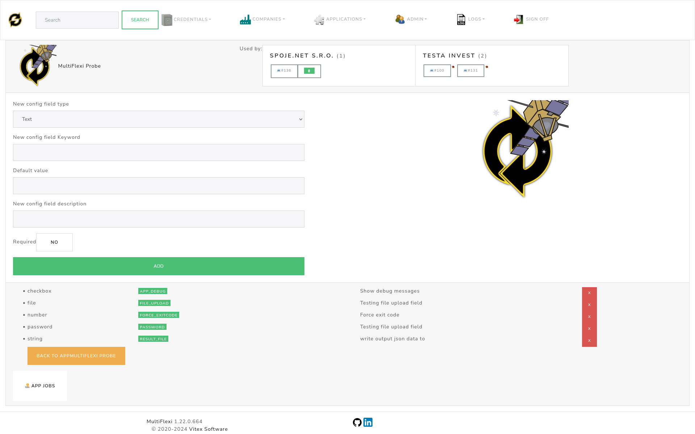

.. _configuration:

Configuration
=============

.. toctree::
   :maxdepth: 2

.. contents::
   :local:

MultiFlexi offers flexible configuration options ranging from server-level environment variables to granular per-application settings.

System Configuration
--------------------

The core system behavior is controlled via environment variables, typically loaded from ``/etc/multiflexi/multiflexi.env``.

Database Settings
~~~~~~~~~~~~~~~~~

- **DB_CONNECTION**: Database driver (e.g., ``mysql``, ``pgsql``).
- **DB_HOST**: Database host address.
- **DB_PORT**: Database port (default: ``3306``).
- **DB_DATABASE**: Database name.
- **DB_USERNAME**: Database user name.
- **DB_PASSWORD**: Database password.

Timezone
~~~~~~~~

- **MULTIFLEXI_TIMEZONE**: Timezone used for scheduling and displaying job/task times
  (e.g., ``Europe/Prague``). Shared by ``multiflexi-web``, ``multiflexi-web5`` and
  ``multiflexi-cli``. If unset, it is autodetected from the server (PHP's
  ``date.timezone`` ini setting, then ``/etc/timezone``, then the ``/etc/localtime``
  symlink, then ``timedatectl``), falling back to ``UTC`` if none of those resolve.
  Set this explicitly whenever the server's detected timezone does not match the
  timezone your schedules are defined in — an undetected mismatch shows scheduled
  times and countdowns offset by the difference from UTC.

Security Options
~~~~~~~~~~~~~~~~

- **ENCRYPTION_MASTER_KEY**: Master key used to encrypt the per-purpose
  encryption keys stored in the ``encryption_keys`` table (Critical: back
  this up — losing it makes all encrypted credential values unrecoverable).
  On package installs, ``multiflexi-common``'s ``debconf`` prompt sets this
  automatically (generated, or a value you supply — see the "Credential
  Encryption Key" step in :doc:`/install`; re-run with
  ``dpkg-reconfigure multiflexi-common`` to change your choice).
  Otherwise set it manually, then run ``multiflexi-cli encryption:init``
  once to generate the ``credentials`` key. ``MULTIFLEXI_MASTER_KEY`` is
  accepted as a backward-compatible alias. Not required for the web
  interface to function — it degrades gracefully (encryption/decryption
  simply unavailable) if unset.
- **CSRF_PROTECTION_ENABLED**: Enable Cross-Site Request Forgery protection (default: ``true``).
- **BRUTE_FORCE_PROTECTION_ENABLED**: Enable protection against brute force attacks (default: ``true``).
- **BRUTE_FORCE_MAX_ATTEMPTS**: Maximum number of failed attempts allowed (default: ``5``).
- **BRUTE_FORCE_LOCKOUT_DURATION**: Duration in seconds to lock out an IP after max attempts (default: ``900``).
- **BRUTE_FORCE_TIME_WINDOW**: Time window in seconds to count attempts (default: ``300``).
- **BRUTE_FORCE_IP_LIMITING**: Enable IP-based limiting for brute force protection (default: ``true``).
- **SECURITY_LOGGING_ENABLED**: Enable security audit logging (default: ``true``).
- **DATA_ENCRYPTION_ENABLED**: When ``true`` (the default), redactable
  (password/secret-typed) Credential field values are required to be
  encrypted (AES-256-GCM) before being written to ``credata.value`` —
  storing them fails closed if ``encryption:init`` has not been run yet.
  Set to ``false`` only for local development/testing, where secret values
  are then stored as plaintext instead. Choosing "Do not encrypt
  credentials (development only)" in ``multiflexi-common``'s install-time
  ``debconf`` prompt sets this automatically.
- **RATE_LIMITING_ENABLED**: Enable general rate limiting (default: ``true``).
- **IP_WHITELIST_ENABLED**: Enable IP whitelisting (default: ``false``).
- **TWO_FACTOR_AUTH_ENABLED**: Enable Two-Factor Authentication (default: ``true``).
- **RBAC_ENABLED**: Enable Role-Based Access Control (default: ``true``).

Session Management
~~~~~~~~~~~~~~~~~~

- **SESSION_TIMEOUT**: Session timeout in seconds (default: ``3600``).
- **SESSION_REGENERATION_INTERVAL**: Interval in seconds to regenerate session ID (default: ``300``).
- **SESSION_STRICT_USER_AGENT**: Enforce strict User-Agent checking for sessions (default: ``true``).
- **SESSION_STRICT_IP_ADDRESS**: Enforce strict IP address checking for sessions (default: ``false``).

API Limits
~~~~~~~~~~

- **API_DEBUG**: Enable API debug mode (default: ``false``).
- **API_RATE_LIMITING_ENABLED**: Enable API-specific rate limiting (default: ``true``).
- **API_RATE_LIMIT_REQUESTS**: Max API requests per window (default: ``100``).
- **API_RATE_LIMIT_WINDOW**: API rate limit window in seconds (default: ``3600``).

Email & Notifications
~~~~~~~~~~~~~~~~~~~~~

- **EMAIL_FROM**: Default sender address for emails (default: ``multiflexi@<SERVER_NAME>``).
- **SEND_INFO_TO**: Email address to send informational notifications to (default: ``false``).

Logging & Telemetry
~~~~~~~~~~~~~~~~~~~

- **LOG_DIRECTORY**: Directory for log files (default: ``/var/log/multiflexi``).
- **ZABBIX_SERVER**: Zabbix server address for logging to Zabbix.
- **ENABLE_GOOGLE_ANALYTICS**: Enable Google Analytics (default: ``false``).
- **LIVE_OUTPUT_SOCKET**: WebSocket URI for live output (e.g., ``ws://localhost:8080``).
- **OTEL_ENABLED**: Enable OpenTelemetry metrics export (default: ``false``). See
  :doc:`/integrations/opentelemetry`.
- **OTEL_SERVICE_NAME**: Service name reported to the OTLP collector, and the value shown
  under the ``otel_scope_name`` label on every exported metric (default: ``multiflexi``).
- **OTEL_EXPORTER_OTLP_ENDPOINT**: OTLP collector ingest endpoint (default:
  ``http://localhost:4318``). This is the metrics/traces ingest URL, distinct from
  ``OTEL_DASHBOARD_URL`` below, which is a browsable UI link.
- **OTEL_EXPORTER_OTLP_PROTOCOL**: OTLP wire protocol, ``http/json`` or ``http/protobuf``
  (default: ``http/json``).

Integrations
~~~~~~~~~~~~

- **NODERED_ENABLED**: Show the Node-RED link in the web interface (default: ``false``).
- **NODERED_URL**: Base URL of the Node-RED editor (e.g., ``http://localhost:1880``). The navbar link appears only when both ``NODERED_ENABLED`` is true and ``NODERED_URL`` is set.
- **NODERED_WEBHOOK_URL**: ``multiflexi-eventor`` Node-RED bridge endpoint. When set, the event processor forwards webhook changes and finished jobs to this Node-RED HTTP-in URL. Leave empty to disable the bridge. Configurable at install time via ``dpkg-reconfigure multiflexi-eventor``.
- **NODERED_TOKEN**: Optional shared secret sent as the ``X-MultiFlexi-Token`` header with each Node-RED bridge request.
- **NODERED_FORWARD_CHANGES**: Forward incoming webhook changes in addition to finished jobs over the Node-RED bridge (default: ``true``).
- **NODERED_CATALOG_URL**: ``multiflexi-eventor`` catalog feed endpoint. When set, the event processor publishes all companies, enabled run-templates and credentials to the ``node-red-contrib-multiflexi`` catalog node, which builds one palette node per entity. Use a path distinct from ``NODERED_WEBHOOK_URL``. Leave empty to disable.
- **NODERED_CATALOG_INTERVAL**: How often (seconds) the catalog is republished; an unchanged catalog (content-hashed) is not resent (default: ``300``).

- **ZABBIX_URL**: Base URL of the Zabbix web frontend (e.g., ``https://zabbix.example.com/zabbix``). When set, a Zabbix entry is added to the **Integrations** menu. This is separate from ``ZABBIX_SERVER`` (see *Logging & Telemetry*), which is the trapper/proxy host used for sending metrics and is not necessarily reachable as a web frontend.
- **OTEL_DASHBOARD_URL**: Base URL of the observability dashboard (e.g., ``https://grafana.example.com``). When set and ``OTEL_ENABLED`` is true, an OpenTelemetry entry is added to the **Integrations** menu. This is separate from ``OTEL_EXPORTER_OTLP_ENDPOINT`` (see *Logging & Telemetry*), which is the OTLP ingest endpoint and is not a browsable UI.

Application Configuration
-------------------------

Each application installed in MultiFlexi defines its own specific configuration fields. These are managed through the web interface.

Configuration Field Types
~~~~~~~~~~~~~~~~~~~~~~~~~

MultiFlexi utilizes a typed configuration system to ensure valid data input:

- **Text**: Standard single-line input.
- **Number**: Numeric input (integer or decimal).
- **Date**: Date picker widget.
- **Email**: Validated email input.
- **Password**: Masked input for sensitive credentials.
- **Checkbox**: Boolean switch (Yes/No).
- **File**: File upload widget.
- **Directory**: Server-side directory path selector.

GDPR & Compliance
-----------------

MultiFlexi includes built-in tools to assist with GDPR compliance.

- **Security Audit**: Logs all access and modification events.
- **Data Encryption**: Encrypts sensitive fields at rest using AES-256.
- **Retention Policies**: Configurable automated data cleanup schedules.
- **Anonymization**: Tools to anonymize personal data after retention periods expire.

Refer to :doc:`/gdpr-compliance` for a detailed implementation guide.

OpenTelemetry
-------------

For enterprise observability, MultiFlexi supports OpenTelemetry.

- **Service Name**: Identifier for the MultiFlexi instance.
- **Collector Endpoint**: URL of your OTLP collector.
- **Protocol**: gRPC or HTTP.

See :doc:`/integrations/opentelemetry` for configuration details.

Logging
-------

Logs are essential for monitoring and troubleshooting.

**Locations:**

- **File**: ``/var/log/multiflexi/multiflexi.log`` (Rotated daily).
- **System**: Syslog / Journald integration.
- **Database**: Viewable via Web UI (latest events).
- **Zabbix**: Real-time error trapping (if configured).

.. tip::

    To watch logs in real-time via CLI:
    
    .. code-block:: bash
    
        tail -f /var/log/multiflexi/multiflexi.log
