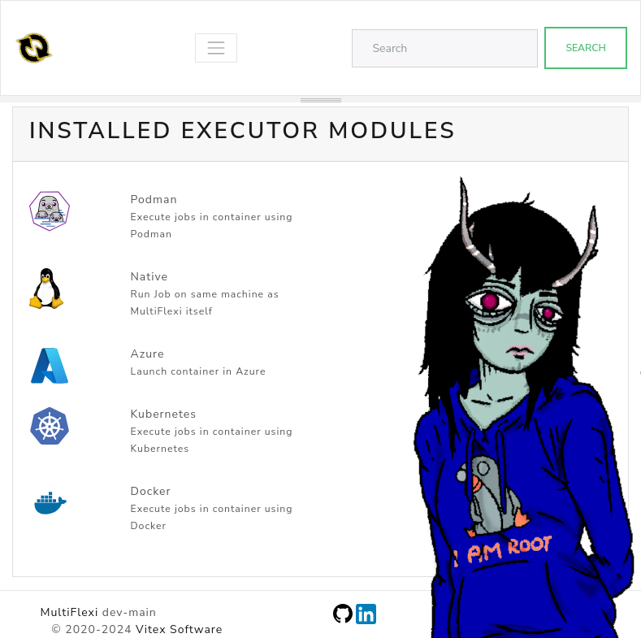

.. _executors:

Executors
=========

.. toctree::
   :maxdepth: 2

.. contents::
   :local:

MultiFlexi supports multiple executor modules that determine *where* and *how*
a job is run.  The executor is configured per-runtemplate and can be changed at
any time via the web interface or the CLI.

Native Executor
---------------

The Native executor runs tasks directly on the host machine without any
containerization.  It is the default executor.

Features:

- Direct execution on the host machine
- No container overhead
- Requires dependencies to be installed on the host
- Uses Symfony Process to launch and monitor commands
- Supports live output streaming via WebSocket

The job command line is constructed from the application's ``executable`` and
``cmdparams`` fields, with environment variables resolved from the runtemplate
configuration.

.. note::

   **Environment variable precedence**: job-level configuration (runtemplate
   config and one-time ``--env`` overrides) takes precedence over any matching
   variable already present in the system environment. This prevents ambient
   system variables (e.g. ``DB_HOST`` set by another service) from silently
   overriding job-specific credentials.

Docker Executor
---------------

The Docker executor runs tasks inside one-shot Docker containers via
``docker run --rm``.

Features:

- Runs tasks in isolated Docker containers with the application ``ociimage``
- Passes job environment through a temporary ``--env-file``
- Optional Docker network via ``MULTIFLEXI_DOCKER_NETWORK``
- Optional ``docker pull`` before each job via ``MULTIFLEXI_DOCKER_PULL``
- Requires Docker Engine; package postinst adds ``multiflexi`` to group ``docker``

**Host setup (summary):** install Docker → install ``multiflexi-executor-docker``
→ confirm ``multiflexi`` ∈ ``docker`` → restart ``multiflexi-executor`` → set
runtemplate ``executor=Docker``.

For the complete numbered checklist, see :ref:`docker-executor-integration`.

Kubernetes Executor
-------------------

The Kubernetes executor runs tasks as one-shot pods inside a Kubernetes
cluster.  When an application declares a ``helmchart``, Helm manages the
in-cluster deployment first; otherwise only the one-shot pod is launched.
Jobs use ``kubectl run --attach``.

Features:

- Runs tasks in isolated Kubernetes pods
- Optional Helm chart deployment when ``helmchart`` is set and the release is
  not already in the cluster
- Artifact collection from pods via ``kubectl cp`` (every path listed in the
  application ``artifacts`` field)
- Pod cleanup after execution (configurable)
- Requires ``kubectl`` in ``$PATH`` (and ``helm`` when using Helm charts)
- Requires a valid kubeconfig accessible by the daemon user
- Namespace override via ``MULTIFLEXI_K8S_NAMESPACE``

The executor reads the ``ociimage`` (required), ``helmchart`` (optional), and
``artifacts`` (optional, comma-separated paths) fields from the application
record.  Environment variables are passed to the pod via ``--env`` flags on
``kubectl run``.

**Execution flow:**

1. If ``helmchart`` is set: check Helm release (``helm status``), then
   ``helm upgrade --install`` when missing
2. Create pod via ``kubectl run --restart=Never --attach``
3. Capture stdout/stderr from the pod
4. Collect every configured artifact path (optional)
5. Delete the pod

The ``multiflexi-executor-k8s`` package ships RBAC manifests at
``/usr/share/multiflexi/k8s/multiflexi-executor-rbac.yaml``.

**Host setup (summary):** install packages → install kubectl/helm → create
namespace → apply RBAC → mint SA kubeconfig → install it as
``/var/lib/multiflexi/.kube/config`` → set ``KUBECONFIG`` and
``MULTIFLEXI_K8S_NAMESPACE`` in ``/etc/multiflexi/multiflexi.env`` → restart
``multiflexi-executor``.

For the complete numbered checklist and verification commands, see
:ref:`kubernetes-integration`.

Podman Executor
---------------

The Podman executor runs tasks in Podman containers.  It is similar to the
Docker executor but uses Podman as the container runtime, which can run
rootless containers without a daemon.

Features:

- Runs tasks in Podman containers
- Rootless container support
- No daemon requirement (unlike Docker)
- Uses the ``ociimage`` field from the application definition

Azure Executor
--------------

The Azure executor runs tasks in Azure Container Instances (ACI).

.. note::

   The Azure executor is experimental and under active development.

Configuring Executors
---------------------

Via the CLI:

.. code-block:: bash

   # Set executor on an existing runtemplate
   multiflexi-cli run-template:update --id=<ID> --executor=Kubernetes

   # Available executor values: Native, Docker, Kubernetes, Podman, Azure

Via the web interface, select the executor from the dropdown when editing a
runtemplate.

