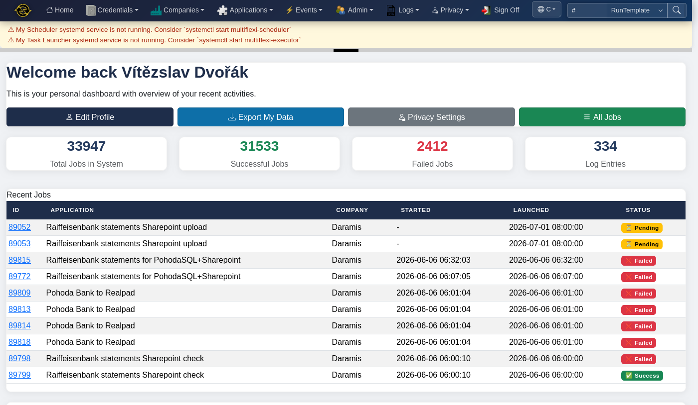
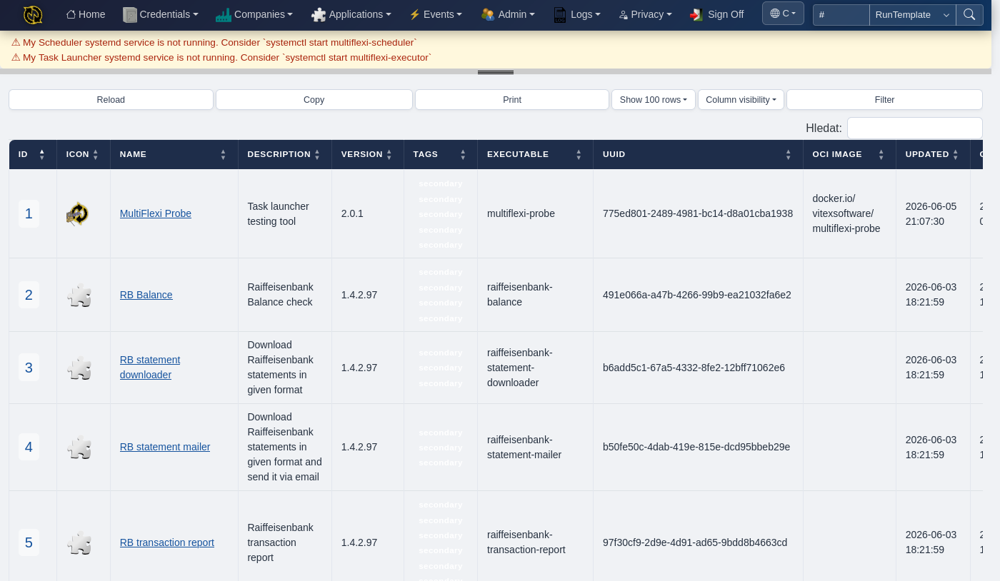
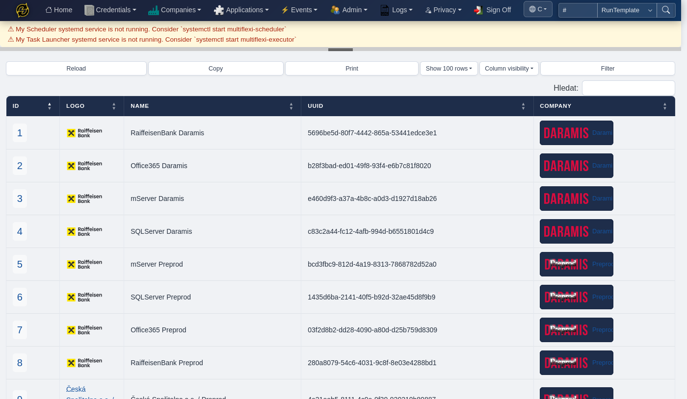
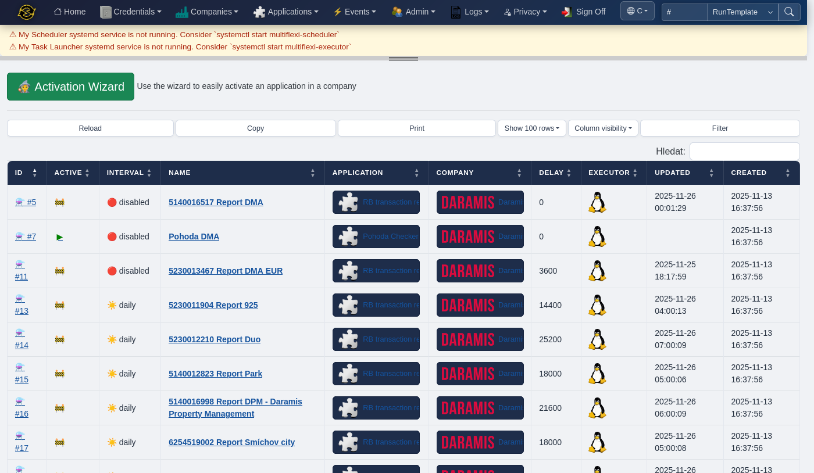

What is MultiFlexi?
===================

MultiFlexi is an open-source task scheduling and automation platform for business system integrations. It lets organizations run applications — importers, exporters, reports, health checks — on a schedule across multiple companies, with isolated credentials and full execution history.

Think of it as **cron on steroids for business automation**: instead of managing scattered shell scripts and cron entries, you register applications once, assign them to companies with the right credentials, and let MultiFlexi handle scheduling, execution, output capture, and monitoring.

.. contents::
   :local:
   :depth: 2

Who is it for?
--------------

**Accounting firms** automating daily tasks for dozens of clients — bank imports, invoice generation, report exports — each running with that client's own credentials.

**Managed service providers** running system health checks, backup verifications, and compliance reports across customer environments on schedule.

**Internal IT teams** synchronizing data between systems, dispatching notifications, and maintaining databases without hand-written automation glue.

Key Concepts
------------

MultiFlexi is built around five core entities that work together:

.. code-block:: text

    Company ──→ RunTemplate ──→ Job
                   ↑               ↑
              Application      Credential

**Company**
   A tenant or organization you automate tasks for. Each company has its own set of credentials and job history, ensuring full data isolation.

**Application**
   A tool that MultiFlexi can execute — a CLI binary, a PHP script, a Docker image. Applications are registered once and can be assigned to any company. Each application declares what environment variables and credentials it needs.

**Credential**
   Securely stored authentication data (API keys, database passwords, SMTP accounts). Credentials are scoped to a company and encrypted at rest with AES-256. They are injected as environment variables when a job runs.

**RunTemplate**
   The link between an application and a company: *"run this app for this company on this schedule with these credentials."* RunTemplates define the interval (hourly, daily, weekly, monthly, yearly) and any extra configuration.

**Job**
   A single execution of a RunTemplate. MultiFlexi records the start time, exit code, stdout, stderr, and any output files as searchable artifacts. Jobs can be triggered on schedule, on demand, or by external events.

How It Works
------------

1. **Register an application** — import its JSON definition or create it in the web UI. The definition declares the executable, required environment variables, and credential types.

2. **Add a company** — create a tenant representing the organization whose tasks you're automating.

3. **Assign credentials** — store the company's API keys, database passwords, or SMTP accounts. MultiFlexi encrypts them and injects them as environment variables at runtime.

4. **Create a RunTemplate** — pick the application, the company, the schedule, and the credentials. This is where you say *"run bank-import for Acme Corp daily at 6 AM using their FioBank API token."*

5. **Jobs run automatically** — the scheduler daemon creates job records when the schedule is due, and the executor daemon picks them up, launches the application in the configured environment, and captures all output.

Execution Environments
----------------------

MultiFlexi can launch applications in several ways:

- **Native** — run the command directly on the server
- **Docker** — run inside a Docker container with the application's OCI image
- **Podman** — rootless container execution
- **Kubernetes** — launch as a K8s pod
- **Azure Container Instances** — run in the cloud

The executor is pluggable: each RunTemplate can use a different execution backend depending on the application's requirements.

Multiple Interfaces
-------------------

You interact with MultiFlexi through whichever interface fits your workflow:

**Web UI** — Bootstrap 5 dashboard with real-time metrics, company/application/credential management, job history, and live output streaming via WebSocket.

**CLI** (``multiflexi-cli``) — full-featured command-line tool for scripting, CI/CD pipelines, and headless administration.

**TUI** (``multiflexi-tui``) — interactive terminal interface built with Bubbletea (Go) for keyboard-driven management.

**REST API** — JSON/XML/YAML endpoints with HTTP Basic and token authentication for programmatic integration.

**MCP Server** — Model Context Protocol server for AI agent integration.

Monitoring and Observability
----------------------------

- **Zabbix** integration with Low-Level Discovery — auto-discovers companies and applications, monitors job success rates and execution times
- **OpenTelemetry** support for distributed tracing
- **Structured logging** to syslog, database, and custom targets
- **Universal artifact preservation** — every job's stdout, stderr, and output files are stored and searchable

Getting Started
---------------

Ready to try it?

- :doc:`quickstart` — install and run your first job in 15 minutes
- :doc:`install` — detailed installation guide for Debian/Ubuntu
- :doc:`tutorial-first-job` — complete end-to-end tutorial
- :doc:`concepts/system-overview` — deep dive into the architecture

.. seealso::

   - `MultiFlexi on GitHub <https://github.com/VitexSoftware/MultiFlexi>`_
   - `MultiFlexi Hub <https://multiflexi.eu>`_ — browse available applications and credential types
   - `Demo Instance <https://demo.multiflexi.eu>`_ — try MultiFlexi without installing
